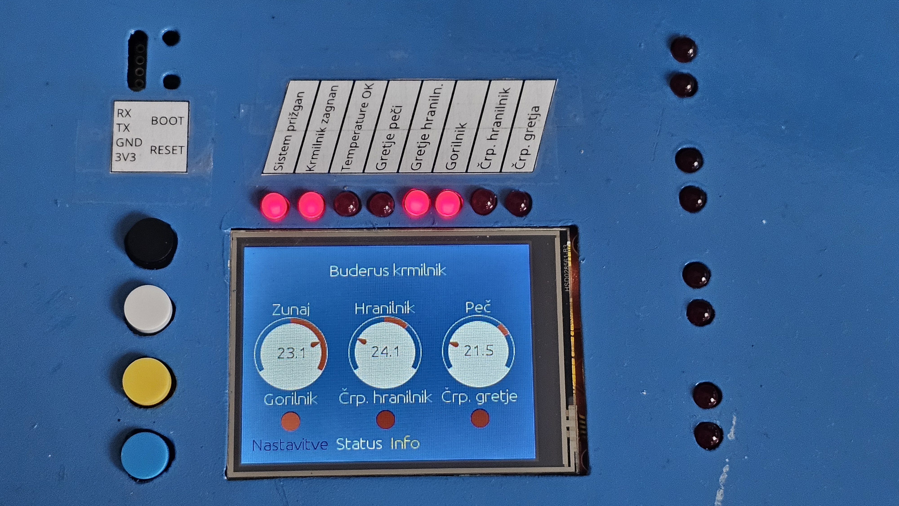

# Solar and Underfloor Heating Regulation Controller

## Overview

This project is a sophisticated heating system controller designed to manage up to 18 relays and 4 motors.
It utilizes DS18XXX temperature sensors for precise thermal regulation and offers WiFi capabilities for remote monitoring and control.
The system features an intuitive touchscreen interface along with physical buttons for ease of use.

Its core functionalities of this controller is managing a Buderus furnace and a domestic hot water (DHW) storage tank. By integrating with these components, the system ensures optimal heating efficiency and consistent hot water availability. The controller can intelligently switch between different heating modes, regulate the temperature of the furnace, and maintain the desired temperature in the DHW storage tank. This comprehensive control mechanism not only enhances comfort but also contributes to energy savings by optimizing the heating cycles and reducing unnecessary energy consumption.

## Project Structure

- **buderus-controller**: Contains the newest simplified controller.
- **esp32-HRC**: The older version of the project.
- **regulator board**: KiCAD PCB design project.

## Schema

## PCB Design

